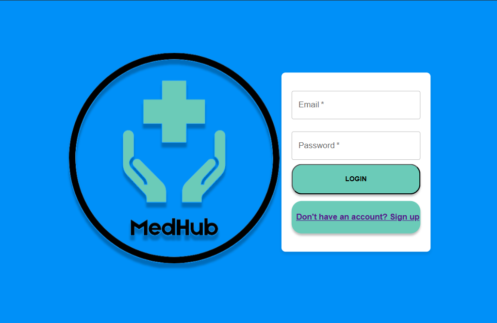
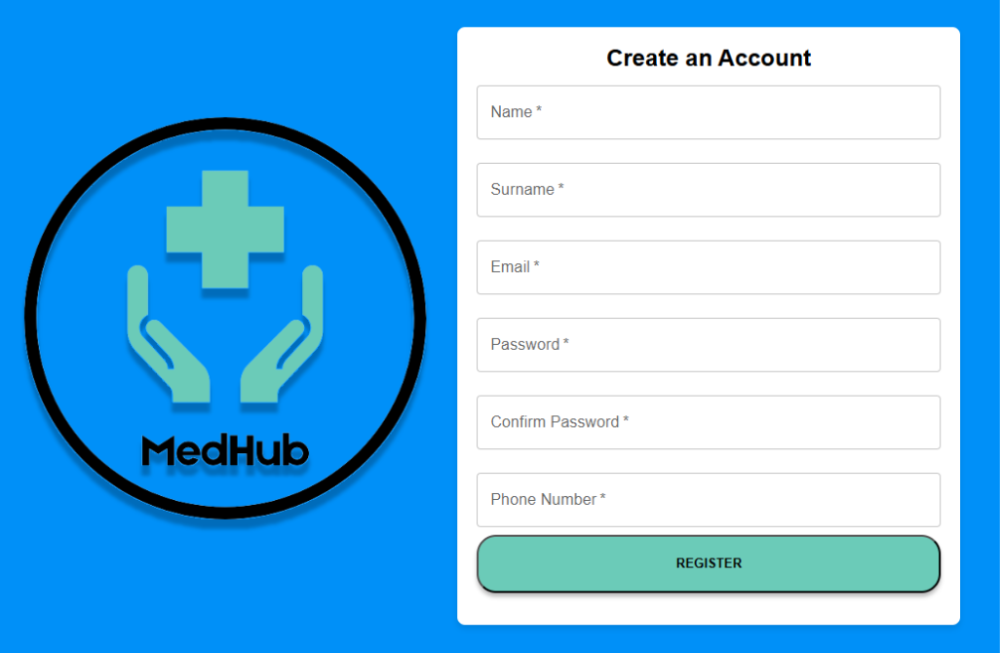
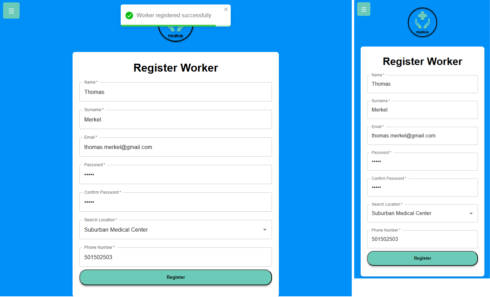
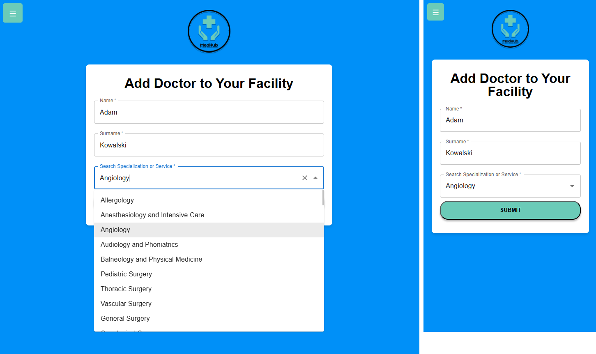
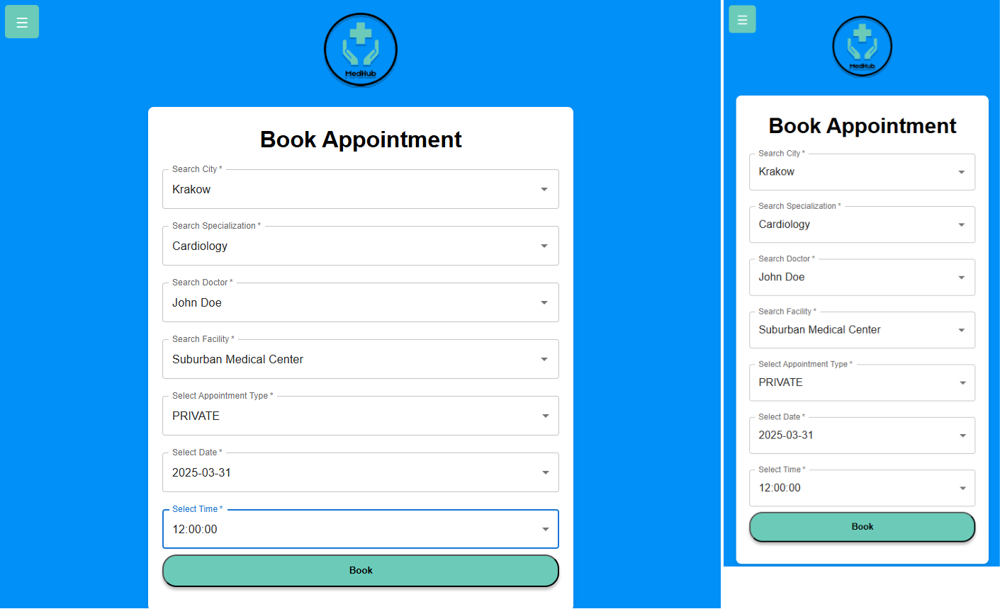
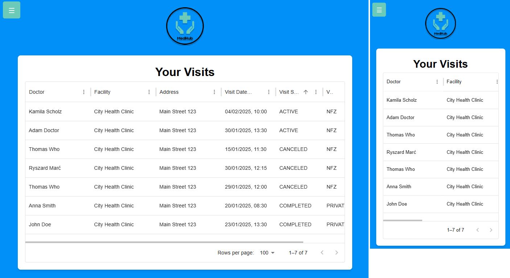
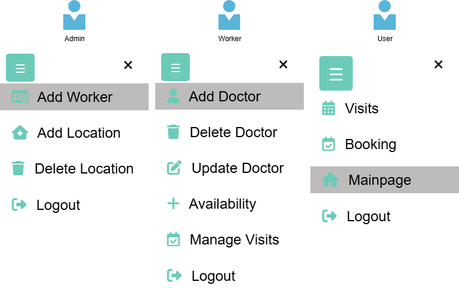
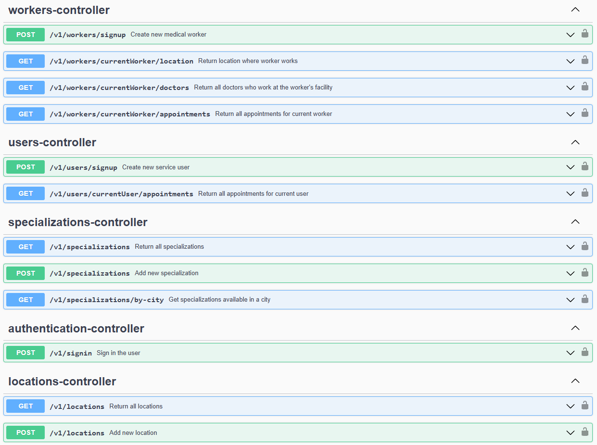

# MedHub

## 🏥 Introduction

MedHub is a web application designed for registering and managing medical visits. MedHub allows users to create accounts, book appointments, manage medical staff and services, and oversee visit schedules all in one intuitive platform.

## 🚀 Local installation

To install MedHub, follow these steps:

1. Clone the repository:
```bash
git clone https://github.com/liseeek/engineer-app.git  
```

2. Configure environment variables:
- Create a `.env` file in the root directory based on the example:
```bash
cp .env.example .env
```
- Open `.env` and provide your secrets (JWT key, encryption key, etc.).

3. Set up the infrastructure and start the application:
- Run this command in the root folder of the project to build and start all services:
```bash
docker-compose up --build -d
```

### 👤 Initial Admin Account
Upon the first launch, the system automatically creates an administrative account:
- **Default Email:** `szymon.lis@gmail.com`
- **Password:** Value defined in your `ADMIN_PASSWORD` environment variable.

## 🛡️ Security Features

MedHub prioritizes data security and privacy through several enterprise-grade features:
- **Data Encryption:** Sensitive patient data (PESEL) is encrypted using **AES-256 GCM** before storage.
- **Authentication:** Secure stateless authentication using **JWT (JSON Web Tokens)**.
- **Role-Based Access Control (RBAC):** Granular permissions for Patients, Doctors, Workers, and Admins.
- **Audit Logging:** All critical operations (like visit cancellations) are automatically logged for security monitoring via AOP (Aspect-Oriented Programming).
- **Soft Delete:** Protected data removal preventing accidental loss and maintaining audit integrity.

## 🧪 Testing

MedHub employs a rigorous testing strategy focused on backend reliability and security.

### Backend Testing Suite
The backend uses **JUnit 5**, **Mockito**, and **AssertJ** for comprehensive verification:

- **Integration Tests**: Utilizes **Testcontainers** to spin up a real **PostgreSQL** instance, ensuring that database migrations (Liquibase) and complex queries work exactly as in production.
- **Concurrency Control**: Specialized tests (`AppointmentsConcurrencyTest`) verify that the system remains thread-safe and prevents double-booking of medical slots under high concurrent load.
- **Security & Privacy**: Automated tests verify the **AES-256 GCM** encryption/decryption of sensitive patient data (PESEL) and the integrity of the hashing mechanisms.
- **Audit Verification**: Integration tests ensure that the **AOP-based audit logging** system correctly captures actor actions, resource IDs, and timestamps.
- **Business Logic**: Extensive unit testing using **Mockito** to isolate service logic and verify edge cases in appointment generation and user management.

**To run the backend tests:**
```bash
cd backend
./gradlew test
```
*Note: A Docker runtime is required for integration tests (Testcontainers).*

## ⚡ Usage and Features

#### MedHub offers several key features, including:

#### 🔑 User Management
- **Create a new user account**
- **Create an employee account**
- **Log in and log out of the platform**

#### 🏥 Medical Facility & Specialist Management
- **Add and remove medical facilities**
- **Add and remove specialists or services**

#### 📅 Appointment Scheduling
- **Book and cancel appointments**
- **Choose a specialist or service**
- **View appointment schedules**
- **View appointment history**
- **Manage appointments efficiently**

## 📦 Dependencies

#### MedHub is built using a variety of technologies and frameworks:

- **Backend:** Java 17, Spring Boot 3, Gradle
- **Database:** PostgreSQL, Liquibase
- **Infrastructure:** Docker
- **Frontend:** React.js, HTML, CSS

#### Ensure you have these technologies installed and properly configured on your system to run MedHub!

## 🖥️ Example Views

### Login


### Register


### Home Page


### Register Worker


### Add Doctor


### Booking


### User Visits


### Role Based Navigation Bar


## 📜 Swagger API Endpoints
- Explore MedHub's API with Swagger:
```
http://localhost:8080/swagger-ui/index.html
```

## 📩 Contact
Created by Szymon Lis - contact me!
- Email: lisszymon.contact@gmail.com
- Linkedin: https://www.linkedin.com/in/lis-szymon/
