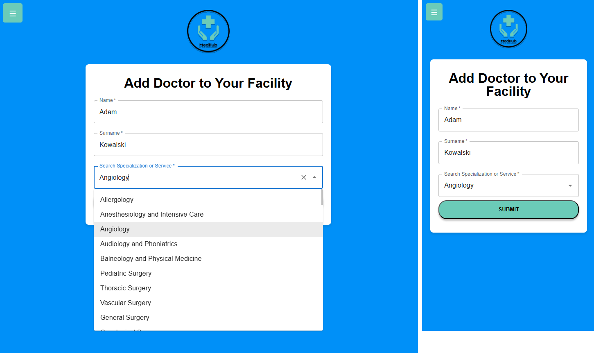

# MedHub

## 🏥 Introduction

MedHub is a web application designed for registering and managing medical visits. MedHub allows users to create accounts, book appointments, manage medical staff and services, and oversee visit schedules all in one intuitive platform.

## 🚀 Local installation

To install MedHub, follow these steps:

1. Clone the repository:
```
git clone https://github.com/liseeek/engineer-app.git  
```
2. Start the backend application:
- Navigate to the `backend` directory.
- Run the command:
```
./gradlew clean build
```
3. Set up the infrastructure with Docker to start the application:

- Run this command in the root folder of the project:
```
docker-compose up --build
```
- Next use this command:
```
docker-compose up -d
```
## ⚡ Usage and Features

#### MedHub offers several key features, including:

#### 🔑 User Management
- **Create a new user account**
- **Create an employee account**
- **Log in and log out of the platform**

#### 🏥 Medical Facility & Specialist Management
- **Add and remove medical facilities**
- **Add and remove specialists or services**

#### 📅 Appointment Scheduling
- **Book and cancel appointments**
- **Choose a specialist or service**
- **View appointment schedules**
- **View appointment history**
- **Manage appointments efficiently**

## 📦 Dependencies

#### MedHub is built using a variety of technologies and frameworks:

- **Backend:** Java 17, Spring Boot 3, Gradle
- **Database:** PostgreSQL, Liquibase
- **Infrastructure:** Docker
- **Frontend:** React.js, HTML, CSS

#### Ensure you have these technologies installed and properly configured on your system to run MedHub!

## 🖥️ Example Views

### Login


### Register


### Home Page


### Register Worker


### Add Doctor


### Booking


### User Visits


### Role Based Navigation Bar


## 📜 Swagger API Endpoints

## 📩 Contact
Created by Szymon Lis - contact me!
- Email: lisszymon.contact@gmail.com
- Linkedin: https://www.linkedin.com/in/lis-szymon/
